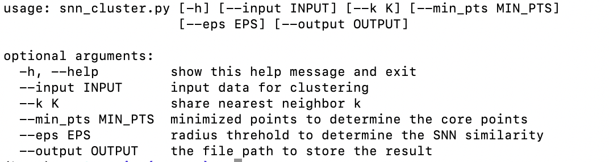
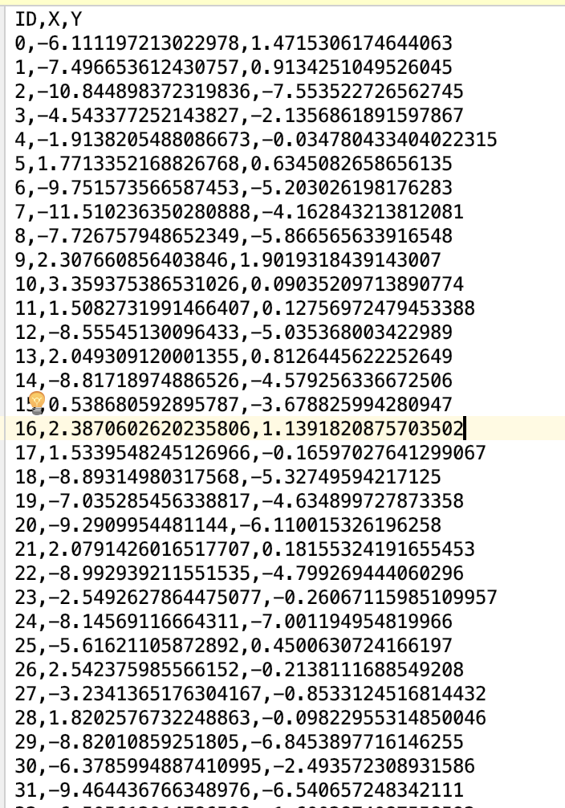
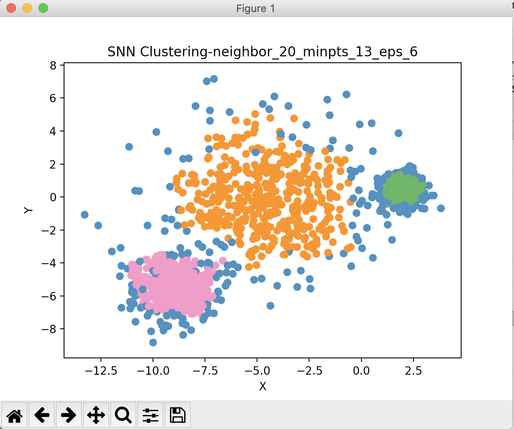

# SNN Cluster

## 安装（Installation）

依赖第三方库:

```
pandas
numpy
scipy
matplotlib
```


## 调用方法（Usage）
#### 查看帮助

```shell script
$ python snn_cluster.py -h
```



#### 调用示例

```shell script
$ python snn_cluster.py --input data/test_text.csv --k 20
```

test_text.csv数据格式如



输出结果示例：

